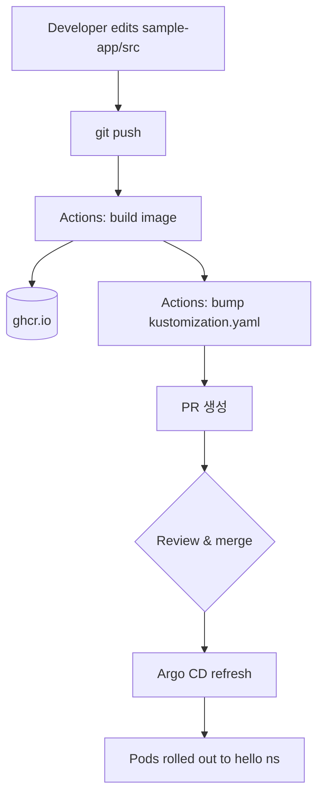

# 01 — ArgoCD + GitHub Actions

**목표**: ArgoCD가 `app/`을 동기화하고, GitHub Actions가 이미지 빌드와 태그 bump PR을 담당하는 전형적인 GitOps 흐름을 경험합니다.

> [!NOTE]
> ArgoCD가 매니페스트를 언제/어디서 렌더링하는지 등 내부 동작이 궁금하면 [ArgoCD Internals](concepts/argocd-internals.md) 참고.

> [!IMPORTANT]
> 현재 저장소는 Stage 2(Image Updater) 로 전환되어 있다. `.github/workflows/image-build.yml` 에는 `bump-manifest` job 이 없고, Stage 1 원형은 `.github/workflows/archive/image-build-with-bump.yml` 에 `on: {}` 로 비활성화된 채 보존되어 있다.
>
> Stage 1 을 재현하려면:
>
> ```bash
> mv .github/workflows/image-build.yml .github/workflows/archive/image-build-stage2.yml
> mv .github/workflows/archive/image-build-with-bump.yml .github/workflows/image-build.yml
> # trigger 가 on: {} 로 비워져 있으니 Stage 1 의 on: push 블록으로 복원
> ```

## Flow



## Prerequisites

- 로컬 변경이 있다면 먼저 원격에 push. ArgoCD는 원격 `main`의 manifest를 읽기 때문에 로컬 수정만으론 반영되지 않는다.

> [!IMPORTANT]
> GitHub repo → Settings → Actions → General → Workflow permissions 에서 아래 **두 항목을 모두 켜야** Actions의 bump PR 생성이 동작한다. 둘 다 기본값은 꺼짐.
> - **Read and write permissions**
> - **Allow GitHub Actions to create and approve pull requests**

## Apply

```bash
make up                                   # k3s + ArgoCD 설치
make password                             # admin 비밀번호 확인
kubectl apply -f bootstrap/hello-app.yaml
make status
```

ArgoCD UI(`make port-forward` 후 https://localhost:8080)에서 `hello` Application이 Synced, Healthy로 올라옵니다.

## Trigger

```bash
echo "<p>$(date)</p>" >> sample-app/src/index.html
git add sample-app/src/index.html
git commit -m "test: refresh page"
git push origin main
```

Actions 탭에서 `image-build` workflow가 돌아가고, 완료되면 `bump-image-sha-XXXXXXX` 브랜치가 만들어지며 PR이 자동 열립니다. PR을 merge하면 ArgoCD가 3분 내에 새 태그로 배포합니다.

## Notes

- **감사 추적**: 태그 bump가 Git 이력에 그대로 남습니다. 어느 커밋이 어떤 버전을 배포했는지 추적됩니다.
- **승인 지점**: PR 리뷰가 배포 직전 gate 역할을 합니다. CI 실패 시 PR이 머지되지 않아 배포도 차단됩니다.
- **app repo 분리**: 실무에서는 애플리케이션 소스 repo와 매니페스트 repo를 나누어 CI 토큰이 매니페스트 repo에만 write 권한을 갖도록 설계합니다.

## Limitations

- Actions 워크플로를 직접 관리해야 합니다.
- 이미지가 외부에서 올라오는(ECR 자동 빌드, 외부 팀 전달) 경우 bump 트리거를 추가로 설계해야 합니다.
- 여러 애플리케이션 이미지를 중앙에서 관리하기 번거롭습니다.

이 한계를 [02 — Image Updater](02-image-updater.md)로 해소합니다.
