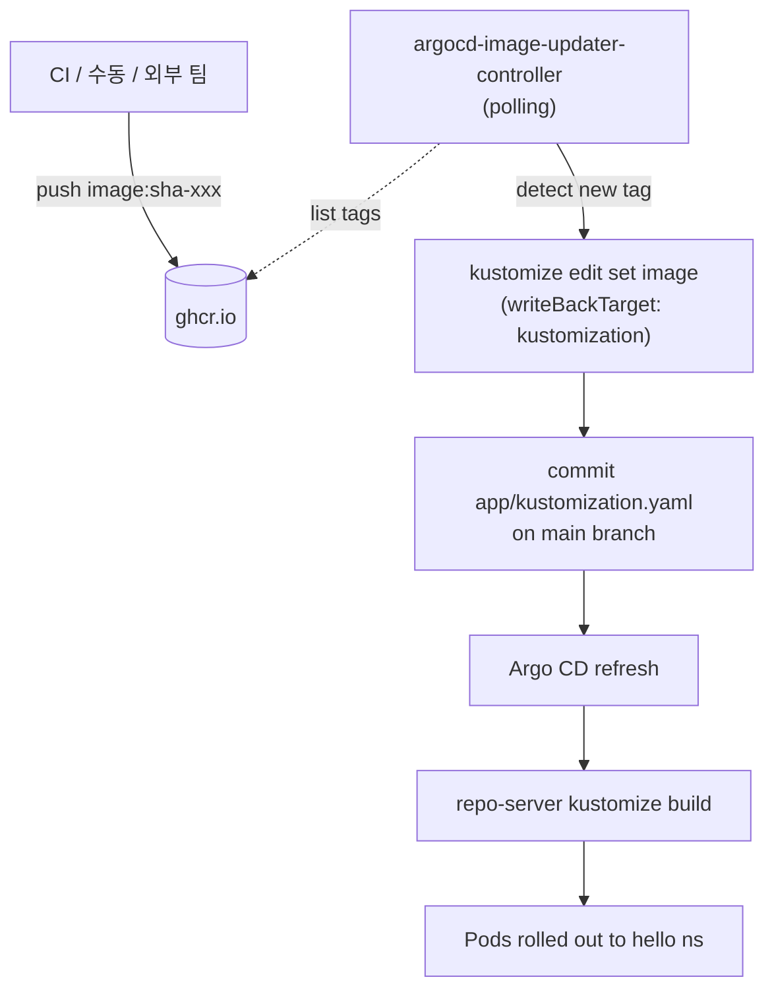

# 02 — Switch to Image Updater (v1.1.1, CRD model)

**목표**: Stage 1의 Actions bump 단계를 Argo CD Image Updater로 대체한다. 이미지가 ghcr.io에 푸시되기만 하면 컨트롤러가 registry polling으로 감지해 `app/kustomization.yaml`의 이미지 태그를 자동으로 bump한다.

> [!NOTE]
> Image Updater는 v1.0부터 구성 모델이 **Application annotation → 별도 `ImageUpdater` CRD** 로 바뀌었다. 이 문서는 v1.x 기준이며, 옛 annotation 예제를 봐도 그대로 적용되지 않는다. (호환을 위해 `applicationRefs[].useAnnotations: true` 옵션은 남아 있음.)

> [!TIP]
> "CI 가 bump 할지 vs 컨트롤러가 bump 할지" 의 개념적 배경은 [Image Bump Ownership](concepts/image-bump-ownership.md) 에 별도로 정리되어 있다.

## Flow



Stage 1과 비교:
- "이미지 빌드 + bump"를 한 워크플로우에서 하던 것 → **빌드만 GitHub Actions, bump는 컨트롤러**
- `bump-manifest` job은 더 이상 필요 없음

## Install the Controller

```bash
./bootstrap/install-image-updater.sh
```

스크립트는:
- `https://raw.githubusercontent.com/argoproj-labs/argocd-image-updater/stable/config/install.yaml` 을 apply (`stable` 브랜치 = 최신 v1.x)
- `argocd` 네임스페이스에 CRD + Deployment(`argocd-image-updater-controller`) + RBAC 생성
- rollout 완료 대기 후 다음 단계 안내 출력

> [!NOTE]
> Stage 1에서 apply했던 `deploy/argocd-image-updater` 를 기대하면 NotFound가 난다. v1.x부터는 Deployment 이름이 `argocd-image-updater-controller` 로 바뀌었다.

## Credentials

### 1. GitHub PAT

다음 scope를 가진 classic PAT 하나 생성:
- `read:packages` — ghcr.io 의 태그를 읽기 위해 (public 이미지면 불필요)
- `repo` — write-back 용 git push 권한

### 2. Kubernetes Secrets

```bash
export KUBECONFIG=$(pwd)/.kube/kubeconfig.yaml

# (private ghcr 이미지를 쓸 때만) registry pull secret
kubectl -n argocd create secret docker-registry ghcr-creds \
  --docker-server=ghcr.io \
  --docker-username=pyy0715 \
  --docker-password=<PAT>

# git write-back 용 — ImageUpdater CR 의 writeBackConfig.method 에서 참조
kubectl -n argocd create secret generic git-creds \
  --from-literal=username=pyy0715 \
  --from-literal=password=<PAT>
```

### 3. (Optional) Commit Author

```bash
kubectl -n argocd patch configmap argocd-image-updater-config \
  --patch '{"data":{"git.user":"image-updater[bot]","git.email":"updater@example.com"}}'
```
설정 안 하면 `argocd-image-updater <noreply@argoproj.io>` 로 커밋된다.

## Apply the ImageUpdater CR

`bootstrap/image-updater-hello.yaml`:

```yaml
apiVersion: argocd-image-updater.argoproj.io/v1alpha1
kind: ImageUpdater
metadata:
  name: hello
  namespace: argocd
spec:
  writeBackConfig:
    method: "git:secret:argocd/git-creds"
    gitConfig:
      branch: "main"
      writeBackTarget: "kustomization"
  applicationRefs:
    - namePattern: "hello"
      commonUpdateSettings:
        updateStrategy: "newest-build"
      images:
        - alias: "hello"
          imageName: "ghcr.io/pyy0715/argocd-study/hello"
```

```bash
kubectl apply -f bootstrap/image-updater-hello.yaml
kubectl -n argocd logs deploy/argocd-image-updater-controller -f
```

필드 의미:

| 필드 | 의미 |
|---|---|
| `applicationRefs[].namePattern` | 감시할 Argo CD Application 이름(glob). `hello` 만 매칭 |
| `applicationRefs[].images[].alias` | 이 설정에 붙이는 짧은 이름. annotation 모델의 `hello=...` 왼쪽에 해당 |
| `applicationRefs[].images[].imageName` | 태그를 제외한 이미지 이름. Updater가 이 레포를 registry polling |
| `commonUpdateSettings.updateStrategy` | `semver`/`newest-build`/`digest`/`alphabetical` 중 선택. 우리 CI 는 sha 태그를 밀기 때문에 `newest-build` (registry push 시간 기반) 사용. v1.x 이전엔 `latest` 라는 이름이었고 아직 별명으로 지원되지만 deprecated. |
| `writeBackConfig.method` | `git:secret:<ns>/<secret>` 형식. 앞서 만든 `git-creds` 참조 |
| `writeBackConfig.gitConfig.branch` | 직접 push할 브랜치. Stage 1에서는 PR gate가 있었지만 **Stage 2는 main 에 바로 커밋** |
| `writeBackConfig.gitConfig.writeBackTarget` | `"kustomization"` — Stage 1에서 만든 `app/kustomization.yaml` 의 `images:` 블록을 `kustomize edit set image` 효과로 수정. 지정 안 하면 `.argocd-source-<app>.yaml` 을 생성해 Stage 1 결과물과 이원화된다. |

## Disable the Old Bump Job (Recommended)

`.github/workflows/image-build.yml` 의 `bump-manifest` job 은 이제 Updater와 겹친다. 두 가지 선택:

1. **job 삭제** — bump를 Updater에만 맡김
2. **workflow_dispatch 전용으로 격리** — 이력 보존

실습에선 1번이 깔끔하다.

## Trigger

```bash
# GitHub Actions 없이 로컬에서 직접 테스트해볼 수도 있다
TAG=test-$(date +%s)
docker build -t ghcr.io/pyy0715/argocd-study/hello:${TAG} sample-app/src
docker push ghcr.io/pyy0715/argocd-study/hello:${TAG}
```

1. Updater 로그에 `hello` 대상 체크 기록이 떠야 한다 (`level=info ... found new version`)
2. `app/kustomization.yaml` 이 `main` 에 직접 커밋됨 (`image-updater[bot]` 저자)
3. Argo CD가 자동 refresh → repo-server가 `kustomize build app/` 재렌더 → Pod 교체

확인:
```bash
export KUBECONFIG=$(pwd)/.kube/kubeconfig.yaml
kubectl -n argocd get imageupdater hello -o yaml | grep -A5 "status:"
kubectl -n hello get deploy hello -o jsonpath='{.spec.template.spec.containers[0].image}{"\n"}'
```

## Notes

- **CI 의존 제거**: 이미지가 어디서 올라오든 Updater가 감지한다. ECR에서 다른 팀이 빌드하든, 로컬에서 `docker push` 하든 동일 경로.
- **중앙 관리**: `ImageUpdater` CR 하나에 `applicationRefs` 를 여러 개 넣으면 앱이 늘어나도 파이프라인 복제가 필요 없다. 공통 `commonUpdateSettings` 는 맨 바깥 `spec` 레벨에서 한 번만 선언.
- **승인 단계 약화**: `branch: main` 으로 직접 커밋하므로 Stage 1의 PR 리뷰 gate가 사라진다. 대체 보호책(이미지 서명, registry 취약점 스캔, `allowTags` 정규식으로 패턴 강제)이 중요해진다.
- **폴링 주기**: 기본값은 ConfigMap `argocd-image-updater-config.interval` 로 설정. registry 호출 비용과 반영 지연의 trade-off.
- **Annotation 호환 모드**: `applicationRefs[].useAnnotations: true` 를 주면 옛 스타일(Application에 annotation 붙이기)도 그대로 먹는다. 이 repo 에서는 CRD 스타일로만 간다.

## Limitations

- 새 이미지가 감지되면 모든 replica 가 한 번에 교체된다. 점진 확대·자동 롤백이 없다.
- main에 직접 커밋하므로 branch protection이 강한 repo 에선 `branch: "main:image-updater-{{.SHA256}}"` 같은 분리 브랜치 전략으로 바꾼 뒤, 외부 PR 자동화(예: Actions)를 붙여야 한다.

이 한계를 [03 — Rollouts](03-rollouts.md) 로 해소한다.
