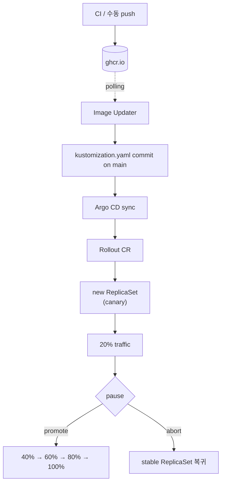

# 03 — Argo Rollouts로 점진 배포

**목표**: Stage 2의 Deployment를 Rollout으로 교체해 canary 단계적 확대와 수동 promote/abort를 경험합니다.

## Flow



## Install Argo Rollouts

```bash
./bootstrap/install-rollouts.sh
```

선택: kubectl 플러그인.

```bash
brew install argoproj/tap/kubectl-argo-rollouts
# 또는
mise use -g argo-rollouts
```

## Replace Deployment with Rollout

Stage 2 의 `Deployment + Service + kustomization.yaml(images override)` 조합을, Stage 3 에서는 `Rollout + Service + kustomization.yaml(images override + configurations transformer)` 로 교체한다.

> [!IMPORTANT]
> Kustomize 의 `images:` 필드는 기본적으로 **Deployment / StatefulSet / DaemonSet 등 빌트인 타입에만** 작동한다. Rollout 은 CRD 라 kustomize 가 `spec.template.spec.containers[].image` 경로를 모른다. 따라서 `configurations:` 에 Argo Rollouts 가 제공하는 transformer 를 등록해 줘야 `images:` override 가 Rollout 에도 먹힌다. 이걸 빠뜨리면 Stage 2 의 Image Updater write-back 이 무효화된다 (컨트롤러가 `kustomize edit set image` 효과로 `newTag` 를 바꿔도 Rollout 매니페스트에 반영 안 됨).

### 1. Rollout manifest 확정

```bash
cat app/rollout.yaml.example | sed '/^#/d' > app/rollout.yaml
```

### 2. Service 파일 분리

```bash
cat > app/service.yaml <<'YAML'
apiVersion: v1
kind: Service
metadata:
  name: hello
spec:
  selector:
    app: hello
  ports:
    - port: 80
      targetPort: 80
YAML
```

### 3. 옛 Deployment 제거

```bash
git rm app/deployment.yaml
```

### 4. kustomization.yaml 갱신

```yaml
# app/kustomization.yaml
apiVersion: kustomize.config.k8s.io/v1beta1
kind: Kustomization

resources:
  - rollout.yaml
  - service.yaml

configurations:
  # Rollout 을 인식하도록 Kustomize 에 transformer 등록.
  # https://argoproj.github.io/argo-rollouts/features/kustomize/
  - https://raw.githubusercontent.com/argoproj/argo-rollouts/master/docs/features/kustomize/rollout-transform-kustomize-v5.yaml

images:
  - name: ghcr.io/pyy0715/argocd-study/hello
    newTag: sha-XXXXXXX   # Image Updater 가 계속 덮어씀. 값 자체는 아무거나 OK.
```

> `configurations` 의 URL 은 Kustomize v5 용. ArgoCD 에 내장된 kustomize 는 v5 라인이라 그대로 작동한다 (Argo CD v2.8+).

### 5. 최종 구조

```
app/
├── rollout.yaml
├── service.yaml
└── kustomization.yaml
```

### 6. Commit & push

```bash
git add app/rollout.yaml app/service.yaml app/kustomization.yaml
git commit -m "Stage 3: swap Deployment for Rollout with kustomize transformer"
git push origin main
```

ArgoCD 가 repo-server 에서 `kustomize build app/` 을 수행 → Rollout / Service 매니페스트 렌더 → 클러스터 동기화. 기존 Deployment 리소스는 Argo CD 의 `prune: true` 정책에 따라 자동 삭제된다.

## Observe

```bash
kubectl argo rollouts get rollout hello -n hello --watch
```

각 step 사이 30초 pause가 있습니다. 새 이미지를 push하면 canary ReplicaSet이 20%부터 시작합니다.

### Manual Control

```bash
# 현재 paused 상태인 step을 바로 promote
kubectl argo rollouts promote hello -n hello

# 전체 abort (stable로 롤백)
kubectl argo rollouts abort hello -n hello

# abort 후 다시 진행
kubectl argo rollouts retry rollout hello -n hello
```

## Notes

- **점진 확대**: replica 비율로 근사 canary weight를 구현합니다. k3s에는 traffic manager가 없으므로 정교한 weight(1%, 5%)는 불가능합니다.
- **실패 격리**: 새 버전이 문제를 일으키면 abort로 stable로 즉시 되돌릴 수 있습니다. blast radius가 단계당 20%로 제한됩니다.
- **CRD 차이**: Rollout은 Deployment와 거의 동일한 spec을 쓰지만, `strategy.canary`나 `strategy.blueGreen`을 추가로 선언합니다.

## Advanced Traffic Splitting (Optional)

프로덕션에서 의미 있는 canary를 구현하려면 traffic manager와 연결합니다.

- **AWS ALB**: AWS Load Balancer Controller의 weighted target group 결합
- **Istio**: VirtualService의 weight 필드 조정
- **Gateway API**: HTTPRoute backendRef weight (Argo Rollouts 1.8+ GA)

또한 **AnalysisTemplate**을 연결하면 Prometheus 쿼리 기반 자동 promote/abort가 가능합니다. 이 repo는 로컬 실습 범위라 AnalysisTemplate은 생략합니다.

## Stage Comparison

| | Stage 1 | Stage 2 | Stage 3 |
|---|---|---|---|
| 이미지 태그 반영 | Actions bump PR | Image Updater 자동 | Image Updater 자동 |
| 승인 gate | PR 리뷰 | 없음(registry 보호 의존) | 없음 + canary pause로 완화 |
| 실패 시 복구 | git revert + 재배포 | git revert + 재배포 | abort로 즉시 stable 복귀 |
| 복잡도 | 낮음 | 중간 | 높음 |
| 추가 의존 | GitHub Actions | Image Updater Pod | Image Updater + Rollouts + (선택) traffic manager, 메트릭 |

실무에서는 **Stage 1 + Stage 3** 조합이 흔합니다. CI의 승인 gate는 유지하면서 배포 자체는 점진 확대와 자동 롤백으로 보호합니다.
