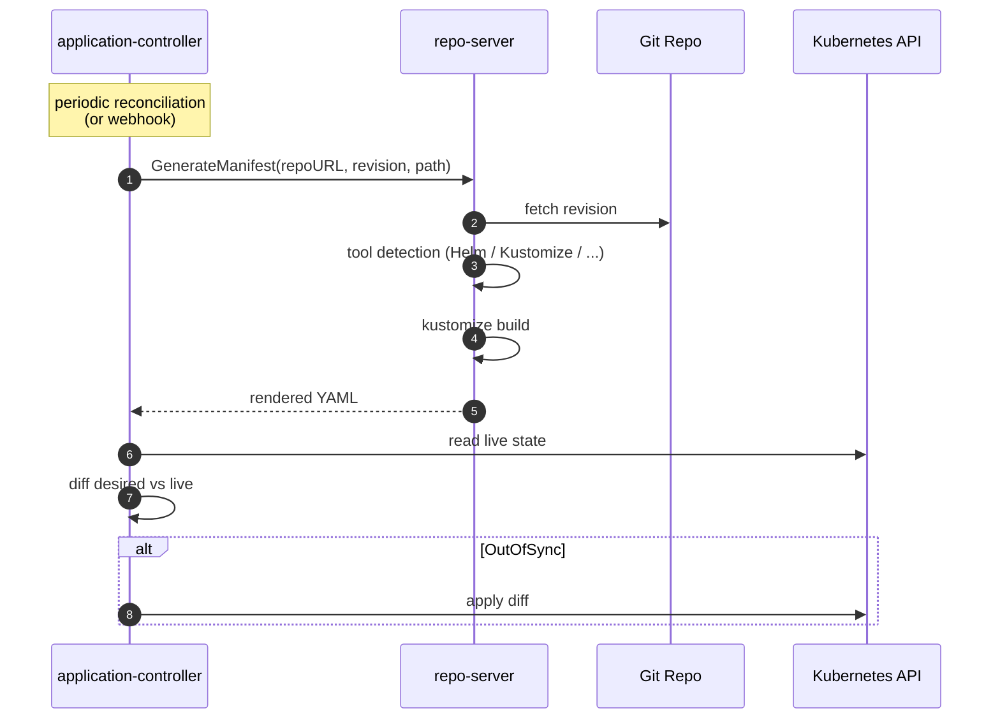

# ArgoCD Internals

실습 중 자주 마주치는 질문 — "manifest는 어디서 렌더링되지?", "ArgoCD가 어느 시점에 git을 본다는 거지?" — 에 답하는 문서. Stage 1·2·3 어디에 있든 공통으로 깔리는 동작 원리를 모아둔다.

## Components

`argocd` 네임스페이스에 뜨는 Pod들:

| 컴포넌트 | 역할 |
|---|---|
| `argocd-server` | REST/gRPC API, UI. `kubectl apply`나 `argocd` CLI가 부르는 대상. |
| `argocd-application-controller` | 상태 루프의 주체. Application CR별로 desired ↔ live 비교 후 동기화 수행. |
| `argocd-repo-server` | **Git에서 매니페스트를 읽고 렌더링하는 Pod**. kustomize/helm/jsonnet 바이너리가 내장되어 있다. |
| `argocd-redis` | repo-server 렌더 결과와 API 응답 캐시. |
| `argocd-dex-server` | SSO(OIDC) 중계. 로컬 admin 로그인만 쓴다면 의미 없음. |
| `argocd-notifications-controller` | 이벤트 기반 알림 (Slack 등). 이 repo 실습 범위 밖. |

확인:
```bash
kubectl -n argocd get deploy
kubectl -n argocd exec deploy/argocd-repo-server -- kustomize version
```

## Sync Flow



1. **Application CR**이 `repoURL / targetRevision / path`를 선언.
2. **application-controller**가 주기적(`timeout.reconciliation`, 기본 3분)으로 또는 webhook으로 "refresh 필요" 판단.
3. **repo-server**에 RPC 호출 → repo-server가 해당 revision을 fetch하고 path 디렉토리에서 빌드 도구 자동 감지 후 렌더링.
4. 렌더링된 YAML을 **application-controller**가 받아서 클러스터의 live 상태와 비교.
5. 차이가 있으면 Kubernetes API를 직접 호출해 동기화 (`syncPolicy.automated` 또는 수동 sync 시).

핵심: **렌더링은 CI가 아니라 클러스터 내부 `repo-server`에서 일어난다.**

## Tool Detection

repo-server가 `path` 디렉토리에서 매니페스트를 어떻게 해석할지 결정하는 우선순위:

| 우선순위 | 조건 | 처리 |
|---|---|---|
| 1 | `Chart.yaml` 존재 | Helm |
| 2 | `kustomization.yaml` / `.yml` / `Kustomization` 존재 | Kustomize |
| 3 | `*.jsonnet` | Jsonnet |
| 4 | ConfigManagementPlugin 매칭 | CMP |
| 5 | 그 외 | plain Directory (`*.yaml` 전부 적용) |

> [!NOTE]
> `spec.source`에 `kustomize:`, `helm:` 같은 블록을 명시하면 자동 감지를 덮어쓸 수 있다. 예) `kustomize.images`로 이미지 override, `helm.values`로 values 주입.

참고: [Tool Detection](https://argo-cd.readthedocs.io/en/stable/user-guide/tool_detection/)

## Kustomize in ArgoCD

이 repo는 Stage 1에서 `app/kustomization.yaml`을 두고 CI가 `kustomize edit set image`로 태그만 bump하는 구조를 쓴다.

- CI가 하는 일: `kustomization.yaml`의 `images[].newTag` 값 변경 → PR → merge.
- ArgoCD가 하는 일: `repo-server`가 merge된 커밋을 fetch → `kustomize build app/` 실행 → 렌더링 결과로 클러스터 동기화.

즉 CI는 **"어떤 태그를 쓸지 Git에 기록"**만 하고, 실제 매니페스트 조립은 ArgoCD가 한다.

### `images:` override 는 CRD 에 자동으로 먹지 않는다

`images:` 필드는 Kustomize 가 "컨테이너 spec 이 어디에 있는지" 알아야 동작한다. 내장 타입(Deployment / StatefulSet / DaemonSet / ReplicaSet / Job / CronJob / Pod) 의 `spec.template.spec.containers[].image` 경로는 하드코딩되어 있지만, **CRD (Rollout, Application, 기타 모든 custom kind) 는 Kustomize 가 구조를 모른다.** 따라서 기본 설정으로는 CRD 내부의 image 필드가 override 대상에서 누락된다.

해결:
```yaml
# app/kustomization.yaml (Stage 3 예시)
configurations:
  - https://raw.githubusercontent.com/argoproj/argo-rollouts/master/docs/features/kustomize/rollout-transform-kustomize-v5.yaml
```
`configurations:` 로 transformer 정의 파일을 등록하면 Kustomize 가 "Rollout 의 `spec.template.spec.containers[].image` 도 image override 대상" 이라는 것을 학습한다. 이 repo 의 Stage 3 전환에서 이 한 줄이 빠지면 Image Updater 가 `newTag` 를 아무리 바꿔도 Rollout 매니페스트에는 반영되지 않는다.

확인:
```bash
# 로컬에서 repo-server가 뱉을 결과를 재현
kustomize build app/

# 클러스터가 실제로 받은 결과
argocd app manifests hello
```
두 출력이 일치해야 Git 상태 = 배포 의도 = 클러스터 상태가 맞는다.

## Caching

- repo-server는 `(repoURL, revision, path, 파라미터)` 키로 렌더 결과를 Redis에 캐시한다.
- 같은 커밋이면 재렌더하지 않는다 → 반복 sync가 빠른 이유.
- 캐시를 강제로 비우려면 `Hard Refresh` (UI의 Refresh → Hard Refresh, CLI: `argocd app get hello --hard-refresh`, 또는 `kubectl annotate app <name> argocd.argoproj.io/refresh=hard`).

### Hard refresh 가 필요한 상황

일반적인 Refresh 는 git HEAD 가 바뀌었는지만 확인하므로 대부분의 경우 자동으로 충분하다. 하지만 다음 상황에서는 캐시가 오래된 결과를 재사용해 실제 변화가 반영되지 않을 수 있다:

- **manifest 구조를 크게 바꿨을 때**: 예를 들어 Deployment → Rollout 처럼 kind 자체가 교체되는 전환. git 상으로는 새 커밋이지만 repo-server 가 이전 sha 의 렌더 결과를 재사용해버리면 live 상태에 반영되지 않는다.
- **`configurations` / `openapi.path` 같은 외부 리소스 추가**: kustomize 동작 방식이 달라졌는데 기존 렌더 결과는 옛 규칙 기반이다.
- **환경 변수 / ConfigMap 같은 외부 입력이 바뀌었는데 git revision 은 그대로**: 이 경우 Argo CD 는 "같은 revision" 으로 보고 캐시 hit.

증상: `Application.status.sync.status` 가 `Synced` 로 보이는데 `.status.resources[]` 에 기대한 새 kind 가 없거나, `kubectl get` 으로 본 live 상태가 Git 과 다름. 이 때 hard refresh 를 한 번 때려주면 재렌더되면서 차이가 드러난다.

## Useful Commands

```bash
# 현재 Application이 참조 중인 git revision
kubectl -n argocd get app hello -o jsonpath='{.status.sync.revision}'

# Desired manifest 덤프 (repo-server 렌더 결과)
argocd app manifests hello

# 라이브 리소스와의 diff
argocd app diff hello

# 강제 refresh (캐시 무시)
argocd app get hello --hard-refresh

# 즉시 sync 트리거 (automated sync여도 주기 기다리기 싫을 때)
kubectl -n argocd patch app hello --type merge \
  -p '{"operation":{"sync":{}}}'
```

## References

- [Argo CD Architecture](https://argo-cd.readthedocs.io/en/stable/operator-manual/architecture/)
- [Tool Detection](https://argo-cd.readthedocs.io/en/stable/user-guide/tool_detection/)
- [Kustomize in Argo CD](https://argo-cd.readthedocs.io/en/stable/user-guide/kustomize/)
