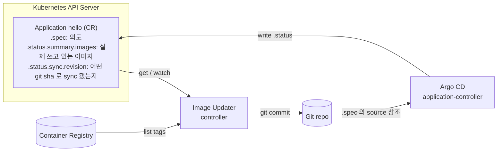

# Controller Coordination via CRs

"Image Updater 는 Argo CD 와 어떻게 이야기하나?" 라는 질문의 답. 둘은 **직접 통신하지 않는다.** Kubernetes API 에 있는 `Application` CR 을 읽고 쓰며, 이 CR 이 공용 게시판(shared state) 역할을 한다. 이 패턴은 Kubernetes 컨트롤러 생태계의 표준 협업 방식이다.

## 문제 상황

Stage 2 에서 Image Updater 는 두 가지 판단을 내려야 한다:

1. registry 에 새 태그가 있는가
2. 클러스터가 **지금 실제로 쓰고 있는 태그** 가 무엇인가 — 이걸 알아야 "bump 해야 할지 말지" 를 결정

1번은 registry API 를 직접 때리면 된다. 2번은? Application 을 배포한 주체는 Argo CD 이다. Image Updater 가 Argo CD 에게 "현재 뭘 쓰고 있어?" 라고 물어볼 수 있어야 한다.

가장 소박한 해결은 "둘을 네트워크로 직접 연결" 이지만 Kubernetes 에서는 그렇게 하지 않는다.

## Kubernetes 컨트롤러 협업 패턴



- Argo CD 는 "내가 배포한 결과" 를 Application.status 에 **계속 기록** 한다. `.status.summary.images`, `.status.sync.revision`, `.status.health.status`, `.status.resources[]` 등.
- Image Updater 는 이 CR 을 **읽을 권한** 만 있으면 Argo CD 내부 상태를 **직접 들여다보는 것과 동일한 정보** 를 얻는다.
- 두 컨트롤러는 서로를 몰라도 된다. 오직 "Application CR 의 스키마" 를 합의 사항으로 공유할 뿐.

이건 Kubernetes 에서 거의 모든 컨트롤러가 쓰는 **blackboard 패턴** 이다. cert-manager 가 Ingress 의 annotation 을 읽어 인증서를 발급하고, External Secrets Operator 가 SecretStore 의 status 를 통해 AWS Secrets Manager 동기화 결과를 공유하는 것도 같은 구조.

## 권한은 RBAC 로 제어

Image Updater 가 Argo CD Application 을 읽을 수 있는 이유는 설치 시 함께 깔린 `argocd-image-updater-manager-role` ClusterRole 덕분:

```yaml
rules:
  - apiGroups: [argoproj.io]
    resources: [applications]
    verbs: [get, list, patch, update, watch]
```

- `get / list / watch` — Application 을 읽고 변경 이벤트를 실시간 수신
- `patch / update` — `write-back-method: argocd` 를 쓸 때 Application.spec 을 직접 수정 (우리 repo 는 git 방식이라 미사용)

즉 "Image Updater 가 Argo CD 의 내부 상태를 안다" 는 표현보다 **"Argo CD 가 자기 상태를 Kubernetes API 에 공개하고, Image Updater 가 RBAC 권한으로 그걸 읽는다"** 가 정확한 기술.

## 실전 타임라인 (이 repo 의 Stage 3 전환 사례)

```
T0  Git 에 Stage 3 구조 push (Rollout 으로 바뀜)
T1  Argo CD repo-server 캐시에 이전 렌더 결과 남아있어서 Deployment 유지
    Application.status.summary.images = sha-d3016cc (Stage 2 시절 값 그대로)
    ↓
T2  Image Updater polling:
    - registry: 최신 = sha-4be1223
    - Application.status.summary.images = sha-d3016cc
    - 둘이 다르다고 판단? 그런데도 bump 안 함
    - 이유: 'newest-build' 가 비교하는 건 "live 이미지 이름에 들어있는 tag" vs "registry 의 최신 tag"
    - 현재 live image 가 sha-d3016cc 인데 registry 의 newest-build 도 해석상 같은 위치면 skip
    ↓
T3  사용자가 hard refresh
    → Argo CD 가 repo-server 재렌더 → Rollout 배포 (kustomization placeholder 때문에 image=sha-XXXXXXX)
    → live state 업데이트 → Application.status.summary.images = [sha-XXXXXXX]
    ↓
T4  Image Updater polling (T3 직후):
    - Application 이 현재 sha-XXXXXXX 를 쓰고 있음 을 감지
    - 이건 registry 에 존재하지 않는 placeholder → 'newest-build' = sha-4be1223 로 교체 결정
    - git commit → main push
```

핵심: Image Updater 가 움직인 트리거는 **registry 변화가 아니라 Application.status 의 변화** 였다. Hard refresh 가 Application.status 를 갱신했고, 그 결과가 Image Updater 의 동작을 유도했다. 두 컨트롤러 사이에 직접 호출이 한 건도 없었는데도 연쇄 반응이 일어난 이유 = **Application CR 이 공용 게시판이었기 때문**.

## 일반화 — 컨트롤러 간 직접 호출을 피하는 이유

1. **느슨한 결합**: Argo CD 가 내부 API 를 바꿔도 Image Updater 코드 불변. 둘은 CR 스키마에만 의존.
2. **관찰 가능성**: 누가 뭘 바꿨는지 전부 Kubernetes API 이벤트로 남음. `kubectl get events`, `kubectl describe` 로 바로 추적.
3. **권한 제어 일관성**: 모든 접근이 RBAC 로 일원화. 네트워크 정책, ServiceAccount, TokenReview 가 그대로 적용.
4. **복원성**: 한 컨트롤러가 죽어도 CR 은 API 서버에 남아있음. 재기동 시 다시 읽으면 그만.

## 참고

- Argo CD 가 Application.status 에 무엇을 쓰는지: [Argo CD Application CRD reference](https://argo-cd.readthedocs.io/en/stable/operator-manual/application.yaml/)
- Image Updater 의 Application 연동 동작: [Update methods — argocd](https://argocd-image-updater.readthedocs.io/en/stable/basics/update-methods/#method-argocd)
- 이 repo 의 Stage 2 설정: [docs/02-image-updater.md](../02-image-updater.md)
- 관련 개념: [Image Bump Ownership](image-bump-ownership.md), [Argo CD Internals](argocd-internals.md)
