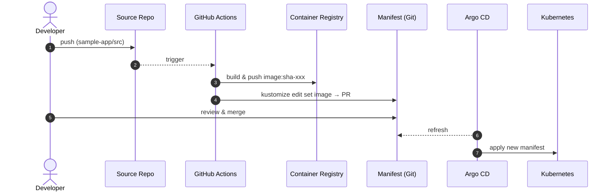
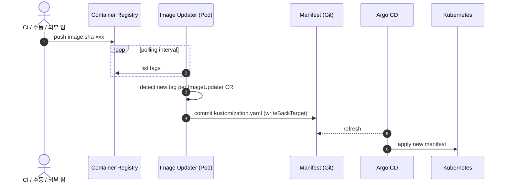
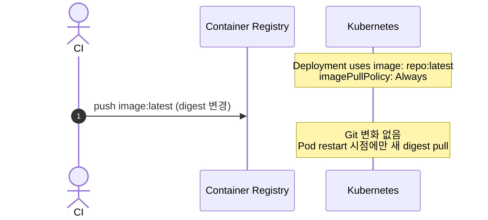

# Image Bump Ownership

ArgoCD 흐름에서 "이미지 새 태그를 manifest에 반영하는 주체" 가 누구인지에 따라 파이프라인의 모양이 완전히 달라진다. 이 문서는 세 가지 전형 패턴을 비교하고, 이 repo 의 Stage 1 ↔ Stage 2 전환이 왜 "패턴 A → 패턴 B" 인지 정리한다.

## 세 가지 패턴

### A. CI 가 bump 한다 (Stage 1)

- **주체**: 소스 저장소의 CI (GitHub Actions, GitLab CI, Jenkins …)
- **트리거**: 소스 repo 의 push 이벤트
- **이미지 검출 방법**: 방금 자기가 빌드/push 했으니 tag 를 그대로 앎
- **쓰기 위치**: manifest 파일 (이 repo 에선 `app/kustomization.yaml` 의 `images[].newTag`)

### B. 컨트롤러가 bump 한다 (Stage 2)

- **주체**: 클러스터 내 컨트롤러 (Argo CD Image Updater)
- **트리거**: registry 의 tag 변화 (polling 또는 webhook)
- **이미지 검출 방법**: registry tag 목록을 실시간 조회
- **쓰기 위치**: 같은 manifest 파일 or `.argocd-source-<app>.yaml`

### C. ArgoCD 가 직접 읽는다 (pull-only, 참고)

- Git 에는 **태그가 변하지 않음**. 실제 실행 이미지는 digest 가 바뀜
- 감사 추적·롤백·GitOps 원칙 모두 약해져서 실무에선 거의 안 씀. 여기선 "왜 이걸 안 쓰나" 이해용으로만 언급.

## 왜 A 와 B 를 섞으면 안 되는가

같은 manifest 파일의 같은 필드 (`newTag`) 를 두 주체가 독립된 일정으로 수정한다는 뜻이다. 결과:

- **경쟁 상태**: A 가 PR 을 만들고 있는 동안 B 가 main 에 직접 commit 하면, A 의 PR 은 stale 이 되거나 merge conflict 로 남는다.
- **원인 추적 곤란**: 어떤 commit 이 "내가 merge 해서 바뀐 것" 인지 "Updater 가 자동으로 쓴 것" 인지 구분 비용이 생긴다.
- **정책 분산**: allow tag 패턴, ignore tag, update strategy 를 A 쪽 (shell script) 과 B 쪽 (CRD) 에 **이중으로** 선언하게 됨.

그래서 Stage 2 로 전환하는 순간 Stage 1 의 `bump-manifest` job 은 **역할을 이관** 해야 한다. 이 repo 에선 `.github/workflows/archive/image-build-with-bump.yml` 에 `on: {}` 로 비활성 보존.

## 책임 경계 표

| 책임 | Stage 1 (A) | Stage 2 (B) |
|---|---|---|
| 소스 → 이미지 빌드 | CI | CI |
| 이미지 → registry push | CI | CI (or 외부 시스템) |
| 새 태그 감지 | CI (자기가 방금 만들었으니) | 컨트롤러 (registry polling) |
| manifest image tag 수정 | CI | 컨트롤러 |
| Git commit / PR | CI | 컨트롤러 |
| manifest → 클러스터 반영 | ArgoCD | ArgoCD |

핵심은 **"새 태그 감지" 와 "manifest 수정" 이 같은 주체에게 묶여야 한다**는 점. 이 두 단계를 분리하면 trigger 없는 쪽이 멍청해지고, 모두 켜면 싸운다.

## 어느 패턴을 고를까

| 상황 | 권장 패턴 |
|---|---|
| 이미지가 같은 repo 의 CI 에서만 만들어진다 | **A**. 단순함. 감사 추적을 PR 이력으로 받음 |
| 이미지가 외부 (다른 팀 / ECR 자동 빌드 / 벤더) 에서 온다 | **B**. A 쪽엔 trigger 가 없음 |
| 여러 앱 × 여러 이미지를 중앙 정책 (semver, allowTags regex) 으로 다스려야 한다 | **B**. `ImageUpdater` CR 하나에 `applicationRefs` 여러 개 |
| 브랜치 보호 때문에 main 에 직접 commit 불가 | **A** 를 유지하거나, B + `branch: "main:image-updater-{{.SHA256}}"` 로 별도 브랜치 → 별도 PR 자동화 조합 |
| 감사·승인 gate 가 **배포 전에** 필요 | **A** (PR 리뷰가 gate). B 는 registry-level 보호 (이미지 서명, 취약점 스캔) 로 대체 |

## 이 repo 의 선택

- Stage 1 이후부터는 **B**.
- 이유: Stage 3 의 Rollouts 까지 가는 학습 동선에서 "컨트롤러 중심 구조" 로 일관되게 감. Stage 2 에서 감지/쓰기를 클러스터 쪽으로 이관해야 Stage 3 의 Rollout 점진 배포와 맞물림이 자연스럽다.
- 승인 gate 는 registry 쪽 보호 (allowTags regex, pull-secret 스코프 제한) 로 대체하는 것이 전제.

## 참고

- 이 repo 의 Stage 2 설정: [docs/02-image-updater.md](../02-image-updater.md)
- Image Updater 공식 문서 — [Update methods](https://argocd-image-updater.readthedocs.io/en/stable/basics/update-methods/)
- `writeBackTarget: kustomization` 이 `kustomize edit set image` 효과를 낸다는 점은 [ArgoCD Internals](argocd-internals.md#kustomize-in-argocd) 참고
